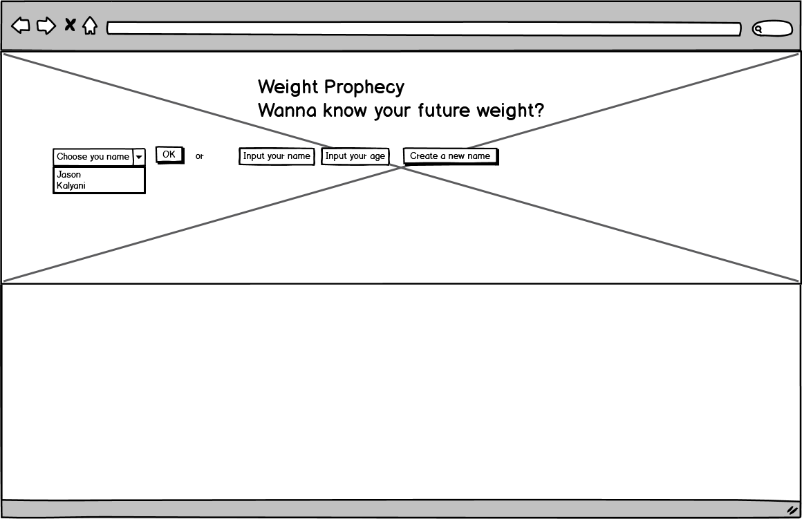
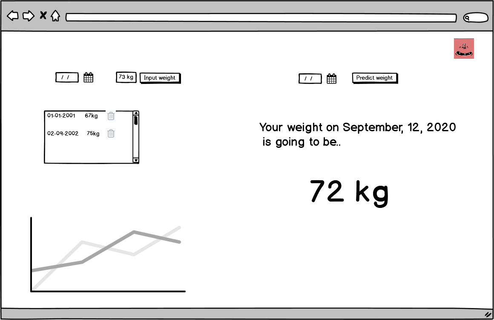
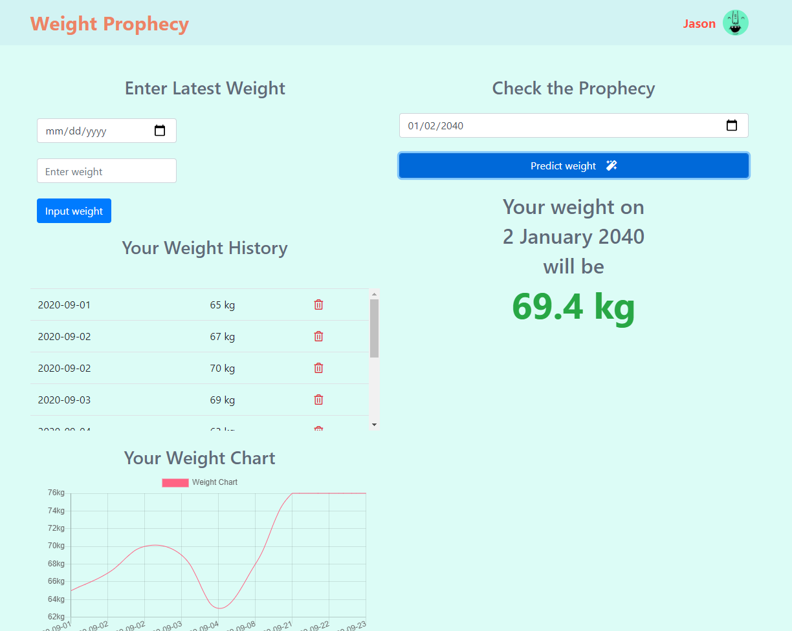

# Weight Prophecy

## Link
### Github link : https://github.com/jasonkim7288/javascript_weightProphecy
### Deploy link : https://weightprophecy.netlify.app/

## Description
Do you want to know how much you are going to weigh after 10 ~ 40 years? This is the right app for you. It will predict your future weight. This app is made by html, css, and javascript. Development has been made with Kalyani, and the whole project duration was 2.5 days.

## wireframes

## Screenshot

## Tech stack
- HTML / CSS / Javascript : front end source code
- Netlify : deploy the code
- Tensorflow js : Machine learning to train the polynomial regression equation with the weight history and predict the weight as a response of user's input
- Chart js : display graph for the weight history
- Bootstrap : a package making pages look pretty